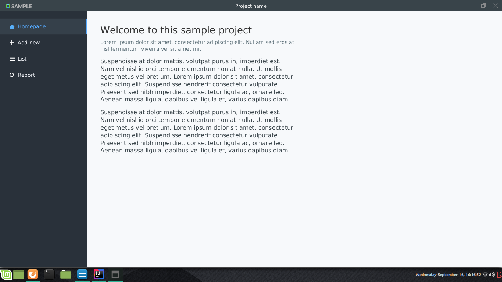
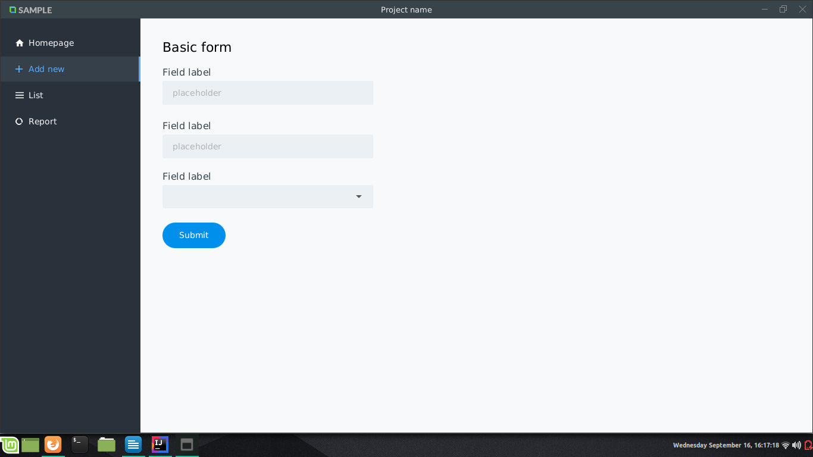

## Sample Desktop Application JavaFX
Um modelo básico de layout para um projeto desktop. Eu decidi criar este modelo por que toda vez que eu iniciava um novo projeto eu precisava criar algo parecido, portanto, uso este modelo para poupar me deste trabalho. É útil para mim e pode ser útil para você, sinta-se a vontade para usar este projeto da forma que quiser.
### Requisitos:
* JDK 11
* Openjfx 11
### Características
Uma janela básica contento:
* Cabeçalho com logo, nome do projeto e controles da janela
* Menu lateral
* Formulário básico
* Página básica
### Screenshots

